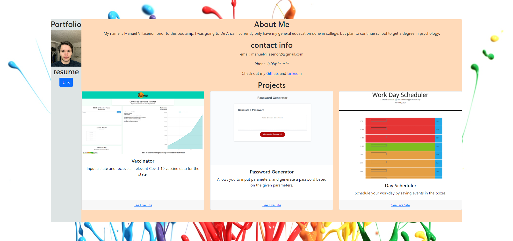
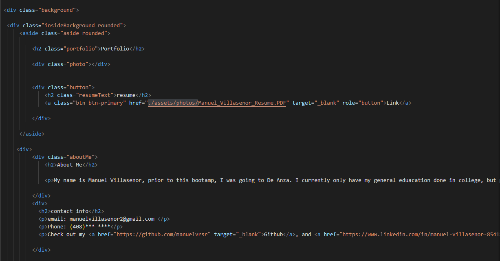

# Portfolio2

## Summary

This is my portfolio page. here you will find a brief summary of myself, contact info, and projects i've done

## Built With

* [HTML - Creates elements on the DOM]
* [CSS - Adds style to html elements]
* [Github - Holds repository that deploys to GitHub Pages]
* [GitBash - For cloning repository and pushing/pulling code to GitHub]
* [Bootstrap - CSS framework]

## Code Snippet  

## Deployed Link

[See Live Site](https://manuelvrsr.github.io/Portfolio2/)

## Authors

**Manuel** 

[Link to Github](https://github.com/manuelvrsr)

[Link to LinkedIn](https://www.linkedin.com/in/manuel-villasenor-854186205/)

